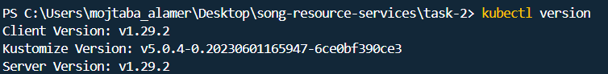
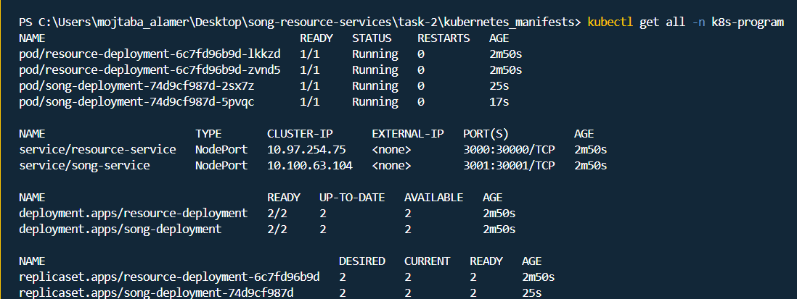
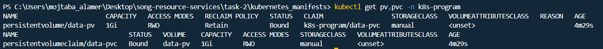
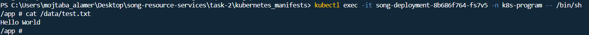
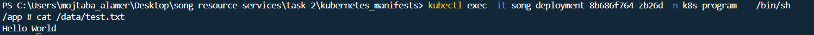
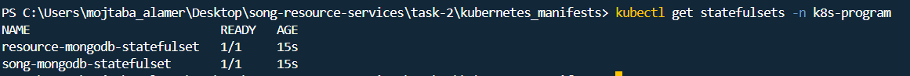

# Solution for (Kubernetes overview Project)

This project is my work according to https://git.epam.com/Siarhei_Svila/kubernetes-mentoring-program/-/blob/main/2-k8s-overview/task/README.md task

all yml files can be found under kubernetes_manifests folder

## Solution
### Sub-task 1: Enable k8s

### Sub-task 2: Deploy containers in k8s
You can see my work under `namespace.yml` & `song-service-deployment.yml` & `song-service-service.yml` & `resource-service-service.yml` & `resource-service-deployment.yml`

You can test the two microservices under port 30001 & 30000

### Sub-task 3: Persistent volumes
You can see my work under `persistent-volume-claim.yml` & `persistent-volume.yml`

Created file under PV folder named /data

The same file can be found under different pod

### Sub-task 4: Stateful Sets
I created two StatefullSets (one for each microservice)

