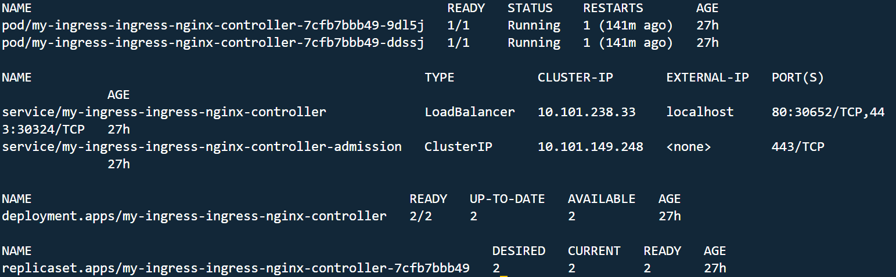
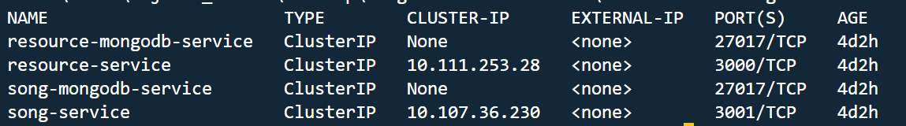
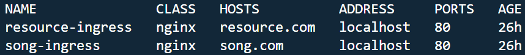
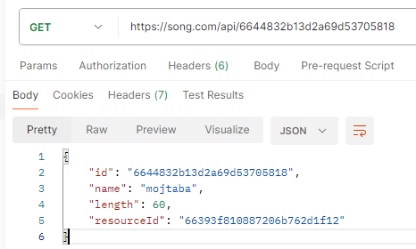

# Solution for (K8S networking)

This project is my work according to https://git.epam.com/Siarhei_Svila/kubernetes-mentoring-program/-/blob/SA-run/5-k8s-networking/task/README.md task

all yml files can be found under kubernetes_manifests folder

## Solution
### Sub-task 1: Ingress

**1.Install ingress controller using helm chart.**

**2.Change Services type to ClusterIP to restrict external access.**

You can see my work under `resource-service-service.yml` & `song-service-service.yml`

Note: 
I wasn't able to apply the last provided feedbacks from the previous module due to the tight deadline

**3.Create ingress resource and route your traffic using rules.**

You can see my work under `song-ingrees.yml` & `resource-ingrees.yml`

**4.Configure rewrite-target of path using annotations.**

You can see my work under `song-ingrees.yml` & `resource-ingrees.yml`

